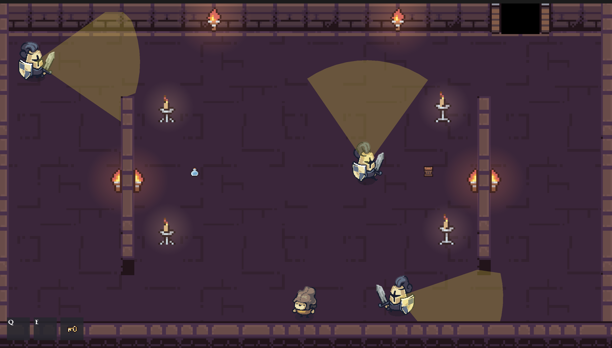

# Ponto Cego

Jogo de stealth 2D top-down feito em Godot 4.7. Manuela foge de uma torre
sombria passando por três áreas (corredor, cozinha e jardim), desviando
dos cones de visão dos guardas, coletando itens e cumprindo os objetivos
de cada fase até chegar à saída.

Jogue agora direto no seu navegador! Disponível em: https://carloshenriquefbf.itch.io/ponto-cego

O documento de design completo está em [`SGDD.md`](SGDD.md).

Feito com Godot, com apoio do Claude Code, usando o [godot-mcp](https://github.com/Coding-Solo/godot-mcp).

## Assets usados

**Imagens de fundo**
- Tela de vitória: https://pixel-1992.itch.io/free-pixel-art-side-scroller
- Menu: https://pixel-1992.itch.io/free-pixel-art-background-dark-gothic-caslte-and-entrance-sprite

**Sprites**
- Personagem, guarda, barra de suspeita e paredes/piso da fase 3 (jardim): https://pixelfrog-assets.itch.io/tiny-swords
- Paredes e piso da fase 2 (cozinha): https://pixel-poem.itch.io/free-rpg-tileset
- Paredes e piso da fase 1 (corredor), velas, tochas, portas, poção e saco de vento: https://pixel-poem.itch.io/dungeon-assetpuck
- Caldeirão da fase 2: https://kaiowoka.itch.io/cauldron-cooking-pot-on-a-fire
- Fogueira da fase 3: https://bonvicio.itch.io/pixel-art-bonfire

**Áudio**
- Sons: https://simon13666.itch.io/sound-starter-pack
- Música: https://gabone-audio.itch.io/medieval-music-pack-vol1-by-gabone-audio

**Fonte**
- https://valiegraphie.itch.io/darinia-medieval-pixel-font?download

---

Alguns sprites foram editados manualmente com o [Aseprite](https://github.com/aseprite/aseprite).
